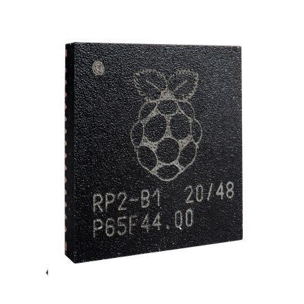
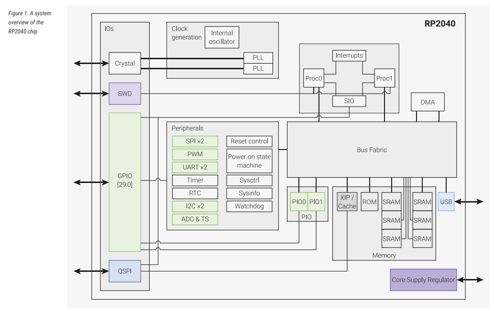

# rp2040
  
<!--  -->
Description and examples for RP2040 elements, subsystems etc.

## Table Of Content
- [System Description](#system-description)
- [Data Bus](#data-bus)
- [Cortex M0+](#cortex-m0)

## System description
  

- 2 Cores
- Arm Cortex M0+
- 133MHz
- SRAM 264kB - addressed as one, physically partitioned into 6 banks
- 30 GPIO
- 6 IO for SPI Flash
- ADC - 4-channel; internal temperature sensor; 12bit conversion;
- USB 1.1
- DMA (Direct Memory Access)
- SWD (Serial Wire Debug)
- APB - Advanced Peripheral Bus
- QSPI - SPI/Dual SPI/Quad SPI
- XIP - Execute In Place, Flash Memory
- PLL - Phase Locked Loop, fixed 48MHz for USB
- SIO - Single-cycle IO; Software Control of GPIO; SIO must be selected to drive GPIO
- PIO - Programmable IO block; PIO must be selected to drive GPIO

## Data Bus
Data Paths are 32-bit wide  
Priority levels are configured per master using BUS_PRIORITY register is BUSCTRL register block  

Bus has 4 masters:
- core 0
- core 1
- DMA read
- DMA write

BUS PERFORAMNCE
- BUSCTRL_PERFCTRx register
- BUSCTRL_PERFSELx register

### APB Bridge 
Access takes 2 cycles at minimum (setup phase, access phase)

## CORTEX M0+
**Configuration for RP2040**
- clock gating
- little endian
- 4 breakpoints
- 32bit instruction fetch
- IOPORT - for low latency access (SIO)
- 26 Interrupts
- 8 MPU (Memory Protecion Unit) regions
- All regsiters reset on powerup

**Architecture**
- ARM v6-M

**M0+ Features**
- ARM v6-M Thumb Instruction Set
- 24bit SysTick Timer
- deterministic, low-latency interrupt handling
- Load/Store multiple instructions (can be abandoned or restarted for an interrupt)
- C ABI - pure C functions as Interrupt handlers
- Low power sleep mode entry - using WFI, WFE or return from interrupt

## DMA
**Direct Memory Access**
- has seperate read and write master connections
- performs bulk data transfers on processors behalf
- let's processor attend other tasks or enter sleep
- data throughput is higher(a lot higher) than of the processor
- usual scenarios:
- - Memory to Peripheral
- - Peripheral to Memory
- - Memory to Memory
- transfer size can be 32, 16 or 8 bit
- channel configuration
- - each channel has 4 registers
- - READ_ADDR - pointer to next address to be read from
- - WRITE_ADDR - pointer to next address to be written to
- - TRANS_COUNT - number of transfers remaining in a sequence
- - CTRL - configure channel behaviour

FIFO - Fist In First Out buffer, temporarily store data in a sequential manner

## Processor subsystem
NVIC - Nested Vector Interrupt Controller
- 26 external interrupts with 4 levels of priority
- Wake-Up Interrupt Controller (WIC)

WIC - Wake-Up Interrupt Controller
- used to wake the processor from a DEEPSLEEP controlled by SCR register
- In DEEPSLEEP state clocks to the processor core and NVIC are not running
- It can take a few cycles to wake-up
- takes inputs from other processor, 32 interrupt lines and NMI

DAP - Debug Access Port
    Provides Serial Wire debug port and connects to processor's slave port

Reset control - controls: debug reset, M0+ core reset, PMU reset

PMU - Power Management Unit

WFI - Wait For Interrupt, provides a mechanism for hardware support of entry to sleep state

WFE - Wait For Event, provides a mechanism for software to suspend program execution until a wake-up condition occurs

MPU - Memory Protection Unit
- 8 user-configurable memory regions
- 8 sub-regions disables, per region
- Execute Nver Support (XN)
- Default Memory Map Support

### Memory
RP2040 has embedded ROM and SRAM and access to external Flash via QSPI

ROM
- 16kB at address 0x00
- Contains
- - initial startup routine
- - flash boot sequence
- - flash programming routine
- - USB mass store device with UF2
- - Utility libraries such as fast floating point
RP2040 bootrom is available at pico-bootrom

SRAM
- 264kB physically partitioned into 6 Banks
- Four 16k * 32bit banks (64kB)
- Two 1k * 32bit banks (4kB)
- Mapped to address starting at 0x20000000

First 256kB region is word stripped across 4 larger banks

| System Address | Bank | SRAM word address |
|----------------|------|-------------------|
| 0x20000000     |   0  |         0         |
| 0x20000004     |   1  |         0         |
| 0x20000008     |   2  |         0         |
| 0x2000000c     |   3  |         0         |
| 0x20000010     |   0  |         1         |
| 0x20000014     |   1  |         1         |
| 0x20000018     |   2  |         1         |
| 0x2000001c     |   3  |         1         |
|      ...       |  ... |        ...        |

4kB Banks start at 0x20040000 and 0x20041000

Software may choose to use each of those banks per core

Other on-chip memory
- if XIP caching disabled,
    the cache becomes available as 16kB memory at 0x15000000
- if USB not used,
    USB DATA DPRAM can be used 4kB memory at 0x50100000

FLASH (external)
- accessed via the QSPI interface
    using the XIP (execute-in-place) hardware
    This allowes external flash memory to be addressed by the system as if it were an internal memory
- Memory window starts at 0x10000000

XIP Cache
- 16kB
- if disabled by clearing CTRL.EN, region behaves as additional 16kB SRAM bank

#### Bootrom
- size limited to 16kB
- contains
- - Core 0 initial boot sequence
- - Core 1 low power wait and launch protocol
- - USB MSC bootloader with UF2 support
- - USB Picoboot bootloader interface
- - Routines for programming and manipulating example. flash
- - Fast floating point library
- - Fast bit counting/manipulation functions
- - Fast memory fill/copy functions

RPI-RPI2 Drive
- appears as standard 128MB flash-drive
- formatted as single partitioned FAT16

Device ID
- idVendor 0x2e8a
- idProduct 0x0003

### PLL - phase locked loop
- generates pll_sys 133MHz system clock
- generates pll_usb 48MHz USB reference clock
- configurable based on used crystal

Crystal 
RP2040 supports 1MHz to 15MHz crystal

Internal Ring Oscillator is configurable but cannot provide accuracy because it varies based on temperature, voltage etc.

External Oscillator
- higher power consumption
- slow startup time (> 1ms)
- fixed, low frequency

### Sys Info
Registers start at 0x40000000 (SYSINFO_BASE in SDK)

| Offset |      Name     |      Info     |
|--------|---------------|---------------|
|  0x00  |    CHIP_ID    |    Chip ID    |
|  0x04  |    PLATFORM   | Allows software to know what environment it is running in    |
|  0x40  | GITREF_RP2040 | Git hash of chip source identifies chip version |

#### CHIP_ID register
| bits   |      Name          |
|--------|--------------------|
|  31:28 |    Revision        |
|  27:12 |    Part            |
|  11:0  |    Manufacturer    |

#### PLATFORM register
| bits   |      Name          |
|--------|--------------------|
|  31:2  |       Reserved     |
|  1     |       ASIC         |
|  0     |       FPGA         |

#### GITREF_RP2040 register
| bits   |      Name          |
|--------|--------------------|
|  31:0  |  Git hash of chip source        |

## Peripherals

### I2C

#### I2C Overview
I2C is a synchronous serial interface  

I2C bus consists of two bus lines:
- SDA - Serial Data
- SCL - Serial Clock
When Idle, both lines are pulled high.  
SDA line is bidirectional, changes only when SCL is low. Except for STOP, START and RESTART conditions.  

Master generates clock and controls the data transfer  
Slave transmits or receives data from the master  

I2C allows multiple masters on the bus, hence it uses arbitration procedure to determine bus ownership.  

Master transmits a START/RESTART condition  
    followed by slave address + the control bit (R/W) . 
    to determine if master wants to write (transmit) or read (receive) the data.  

Slave sends an ACK after the address  

If Master is writing to slave, the receiver gets 1 byte of data, it continues until Master terminates the transmission with a STOP condition

If the Master is reading to a slave, the receiver gets 1 byte of data and Master sends an ACK  
    The transaction continues until the master termiantes it by NACK after the last byte.
    Then Master issues a STOP or addresses another slave issuing a RESTART.

Conditions:
- START - SDA goes high to low, while SCL is high
- STOP - SDA goes low to high, while SCL is high

##### 7bit address format

| S | A6 ... A0 | R/W | ACK |
|---|-----------|-----|-----|
| START | SLAVE Address| Read/Write bit | Acknowledge - sent by slave | 

R/W = 0 - MASTER writes to SLAVE
R/W = 1 - MASTER reads from SLAVE

##### 10bit address format
2 Bytes are transferred

| S | 1 1 1 0 | A9 A8 | R/W | ACK |A7 ... A0 | ACK |
|---|---------|---|----|----|-----|-----|----------|-----|
| START | Notifies of 10bit addressing | SLAVEaddress [9:8] | Read/Write bit | Sent by slave | SLAVE address [7:0] | Sent by slave |

#### I2C in RP2040
RP2040's I2C controller is based on Synopsys DW_apb_i2c IP  
RP2040 has 2 instances of said I2C controller (i2c0 and i2c1)  

Supports:
- Master and Slave Mode (Master as Default)
- Modes:
- - Standard[100kbps]
- - Fast[400kbps]
- - Fast mode Plus[1000kbps]
- Default Slave address 0x055
- Supports 10bit addressing in Master Mode
- 16 element transmit buffer
- 16 element recieve buffer
- Can be driven from DMA
- Can generate interrupts

Clocking:  
I2C controllers are connected to clk_sys, including ic_clk

GPIO Pads Configuration  
- Pull-Up enabled (advised to put external pull-ups as well)
- slew rate limited
- schmitt trigger enabled

I2C Controller contains
- AMBA Bus Interface Unit
- Register File
- Slave State Machine
- Master State Machine
- Clk Generator
- Rx Shift
- Tx Shift
- Rx Filter
- Synchronizer
- DMA Interface
- Interrupt Controller
- Toggle
- RX FIFO
- TX FIFO
(PAGE 443 of RP2040 documentation)

When operating as I2C MASTER, putting data to the transmit FIFO causes a START generation  
Writin a 1 to IC_DATA_CMD.STOP causes a STOP condition 
    STOP is not issued if the bit is not set, even if FIFO is empty

When operating as I2C SLAVE, DW_apb_i2c doesn't generate START and STOP  
If read request is made, the SCL line is held low until read data has been supplied  
    This stalls the I2C bus until read data is provided to the slave DW_apb_i2c  
    or until the DW_apb_i2c is disabled by writing a 0 to IC_ENABLE.ENABLE

DW_apb_i2c supports mixed write and read combined format transactions in both 7bit and 10bit addressing modes  

It does not support mixed address format, which is 7bit address transaction, followed by a 10bit address transaction and vice versa  

To initiate combined format transfer set IC_CON.IC_RESTART_EN to 1  
With this value set and operating as Master, in that case after completing a transfer, DW_apb_i2c checks transmit FIFO and executes the next transfer.

If direction is different from previous one, combined format is issued if transmit FIFO is empty when current transfer finishes IC_DATA_CMD.STOP is checked  
    if STOP bit is set to 1, STOP is issued  
    if STOP bit it set to 0, SCL line is held low until next command is written to transmit FIFO

To use DW_apb_i2c as slave
- disable DP_apb_i2c by writing 0 to IC_ENABLE.ENABLE
- write to IC_SAR to set the slave address
- write to IC_CON to specify type of addressing 7 or 10 bit by setting bit 3
- enable DW_apb_i2c in slave-only made by IC_SLAVE_DISABLE bit = 0 and bit zero of MASTER_MODE = 0

